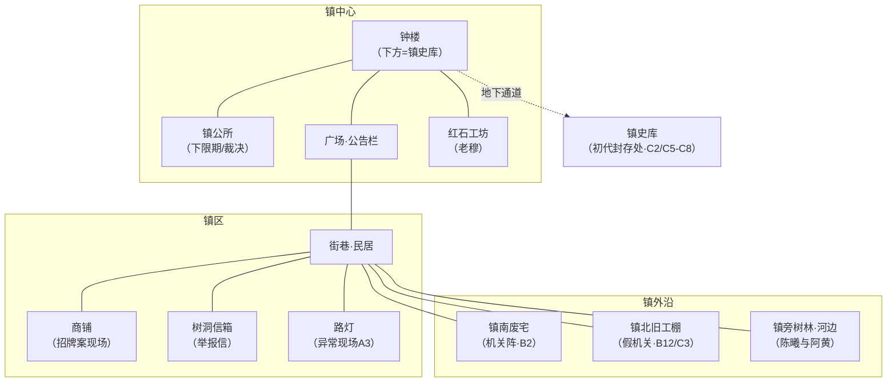

# 《服管足行志（Logs）》· 第 4 步 凌霄小镇地图

## 空间地图（Mermaid）

## 图例

- **钟楼/镇史库**：整季暗线核心。地面上是异常主控线的终点（A10），地下是决战现场（C4-C8）。
- **红石工坊（老穆）**：反派藏身处。他修过的灯/门/机关都在异常点附近（B6），是借名手法的破绽源。
- **树洞信箱/公告栏**：举报信入口（A2）；后期公告被改也是异常之一。
- **镇南废宅**：老穆"顺嘴"引三人去的地方，机关阵+帮手围堵（B2）。
- **镇北旧工棚**：服管设的假目标（B12），郭平在此识破调虎离山（C3）。
- **镇旁树林·河边**：陈曦与阿黄的活动地，也是她直觉的"主场"。

## 场景使用原则

- 场景切换必有动机；同一场景充分延展（如钟楼分 A8 地面、B1 下探、C1-C8 地下多场）。
- 主舞台：钟楼/镇史库（暗线）、街巷民居（异常现场）、红石工坊（老穆）、镇南废宅（打戏）、镇北旧工棚（三线）。不反复"蹲档案室"。
